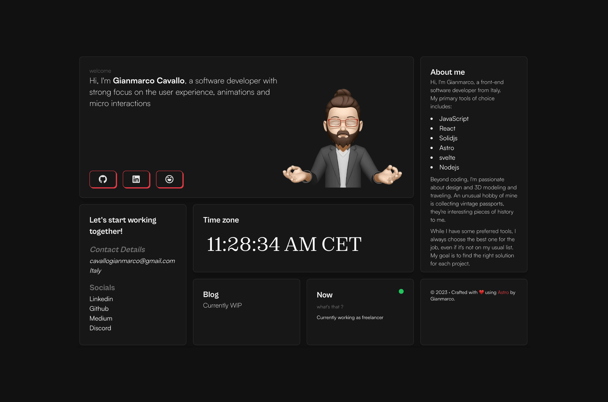

# ⚡️Mario tree

## A personal portfolio website made using `Astro`.



# Steps ▶️

```bash
# Clone this repository
$ git clone https://github.com/Ahzer0Coder/Mario.git
```

```bash
# Go into the repository
$ cd Mario
```

```bash
# Install dependencies
$ pnpm install
or
$ npm install
```

```bash
# Start the project in development
$ pnpm run dev
or
$ npm run dev
```

# Customize your portfolio
After installing dependencies, run:

```bash
$ pnpm run site-setup
```

